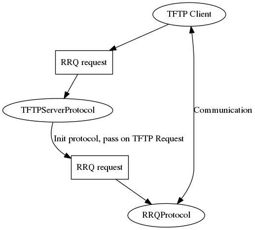

# Py3tftp

Py3tftp is an asynchronous [TFTP][1] server written in Python 3.5. It was written for the pure joy of working with Python 3 and implements [RFC 1350][2] (except _mail_ and _netascii_ modes), [RFC 2347][3] (options), [RFC 2348][4] (blksize option), and part of [RFC 2349][5] (timeout, no tsize).

While a toy project, it does adhere to enough of the standards to be useful in real life.

Some Py3k stuff it uses:
- asyncio - [Transports and Protocols][6] for networking.
- asyncio - [Tasks][7] for spinning up extra handlers.
- [New unpacking methods][8] - some sweet stuff right there (3.5+)
- [Tracebacks attached to exceptions][9] - woo!
- Strings are now bytes because all text is unicode

### Installation

```
pip install py3tftp
```

### Usage

Invoking pyt3tftp will start a server that will interact with the current working directory - it will read and write files from it so don't run it in a place with sensitive files!

TFTP has no security features, except for its simplicity:
- It won't overwrite files.
- Won't create non-existant directories.
- Cannot write outside of the directory it's running from.

```
usage: py3tftp [-h] [--host HOST] [-p PORT] [--ack-timeout ACK_TIMEOUT]
                   [--timeout TIMEOUT] [-l FILE_LOG] [-v] [--version]

optional arguments:
  -h, --help            show this help message and exit
  --host HOST           IP of the interface the server will listen on.
                        Default: 0.0.0.0
  -p PORT, --port PORT  Port the server will listen on. Default: 9069. TFTP
                        standard-compliant port: 69 - requires superuser
                        privileges.
  --ack-timeout ACK_TIMEOUT
                        Timeout for each ACK of the lock-step. Default: 0.5.
  --timeout TIMEOUT     Timeout before the server gives up on a transfer and
                        closes the connection. Default: 3.
  -l FILE_LOG, --file-log FILE_LOG
                        Append output to log file.
  -v, --verbose         Enable debug-level logging.
  --version
```

#### Testing

I wrote some simple acceptance tests in `tests/acceptance/*_test.py`. The code is messy as it's meant to be thrown away.

```
# runs the server with python -m py3tftp
# runs unittests under tests/
# kills the server
./.travis/run.sh
```

#### Extending py3tftp

The way that this module works is that there's a subclass of `BaseTFTPServerProtocol` scheduled on the IO loop that listens for incoming TFTP requests and decides what kind of `BaseTFTPProtocol` to schedule on the IO loop to handle the incoming request.

The way this works in the default scenario is that `TFTPServerProtocol` listens to incoming requests. When a request comes in, it selects either the `WRQProtocol` or the `RRQProtocol` to create a task in the IO loop and passes the request to the selected protocol upon instantiation. From then on, the instantiated protocol handles all of the communication with the client and the _TFTPServerProtocol_ goes back to listening for requests.

This amazing diagram illustrates the above process in the case of a RRQ request:



Extending py3tftp is as easy as:

- Subclassing `BaseTFTPServerProtocol`, mainly to implement the `select_protocol` method to select your custom protocol.
- Subclassing either `RRQProtocol` or `WRQProtocol` to implement your own logic (new options, file handling, etc.) for standard WRQ and RRQ requests, OR...
- Subclassing `BaseTFTPProtocol` to implement your own logic for a custom type of request.

#### Roadplan

- ~~fix off-by-one blksize error ie. if you transfer a file 1000 bytes long and set blksize to 1000 bytes, the server won't ack it.~~
- ~~Pull out file reader/writer from protocol classes~~.
- Add tsize from RFC 2349.
- Add ~~blksize~~, ~~timeout~~, and tsize tests.
- Possibly implement RFCs 906 and 951 for fun!

#### LICENSE

The MIT License (MIT)

Copyright (c) 2016 sirMackk

Permission is hereby granted, free of charge, to any person obtaining a copy
of this software and associated documentation files (the "Software"), to deal
in the Software without restriction, including without limitation the rights
to use, copy, modify, merge, publish, distribute, sublicense, and/or sell
copies of the Software, and to permit persons to whom the Software is
furnished to do so, subject to the following conditions:

The above copyright notice and this permission notice shall be included in all
copies or substantial portions of the Software.

THE SOFTWARE IS PROVIDED "AS IS", WITHOUT WARRANTY OF ANY KIND, EXPRESS OR
IMPLIED, INCLUDING BUT NOT LIMITED TO THE WARRANTIES OF MERCHANTABILITY,
FITNESS FOR A PARTICULAR PURPOSE AND NONINFRINGEMENT. IN NO EVENT SHALL THE
AUTHORS OR COPYRIGHT HOLDERS BE LIABLE FOR ANY CLAIM, DAMAGES OR OTHER
LIABILITY, WHETHER IN AN ACTION OF CONTRACT, TORT OR OTHERWISE, ARISING FROM,
OUT OF OR IN CONNECTION WITH THE SOFTWARE OR THE USE OR OTHER DEALINGS IN THE
SOFTWARE.


[1]: https://en.wikipedia.org/wiki/Trivial_File_Transfer_Protocol
[2]: https://tools.ietf.org/html/rfc1350
[3]: https://tools.ietf.org/html/rfc2347
[4]: https://tools.ietf.org/html/rfc2348
[5]: https://tools.ietf.org/html/rfc2349
[6]: https://docs.python.org/3/library/asyncio-protocol.html
[7]: https://docs.python.org/3/library/asyncio-task.html#task
[8]: https://www.python.org/dev/peps/pep-0448/
[9]: http://legacy.python.org/dev/peps/pep-3109/
